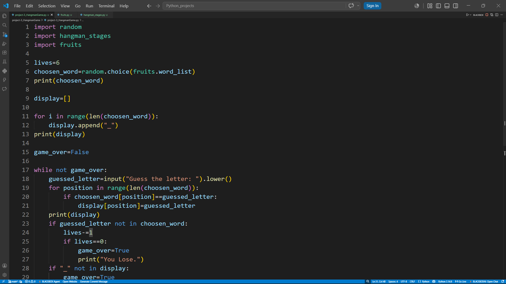

# Python-Projects

## Project-1 : Rock Paper Scissors Game

A simple command-line Rock Paper Scissors game built using Python. The player competes against the computer, which randomly chooses Rock, Paper, or Scissors.

### Features

- Interactive gameplay through the terminal
- Random computer choices using Python's `random` module
- ASCII art representation of Rock, Paper, and Scissors
- Win, lose, and draw detection
- Input validation for invalid choices

### Example Output
 
```text
Enter your choice(Type 0 for Rock, 1 for Paper, 2 for Scisor):0

You chose: Rock
Computer chose: Scissors

You win!
```

### Preview


## Project-2 : Password Generator

A simple Python program that generates a random password based on the number of letters, numbers, and symbols specified by the user.

### Features

- Generates random passwords
- Includes uppercase and lowercase letters
- Includes digits (0-9)
- Includes special symbols
- User can customize the number of:
  - Letters
  - Numbers
  - Symbols

### Example Output

```text
Welcome to Password Generator!
How many letters you want in your password: 5
How many numbers you want in your password: 3
How many symbols you want in your password: 2

Password: AbXde731!$
```

### Preview


## Project-3 : Hangman Game

Hangman is a classic word guessing game developed using Python. In this game, the player has to guess the hidden fruit name one letter at a time. For every incorrect guess, a part of the hangman figure is drawn. The game ends when the player either guesses the complete word or loses all available lives.

### Features

- Random fruit word selection for every game.
- User-friendly letter-by-letter guessing system.
- Visual hangman stages displayed after wrong guesses.
- Tracks remaining lives.
- Win and lose conditions implemented.
- Beginner-friendly project structure using separate modules.

### Example Output

In this example, the randomly selected word is **apple**. Each wrong guess changes the appearance of the hangman.

```text
apple
['_', '_', '_', '_', '_']

Guess the letter: z
['_', '_', '_', '_', '_']

  +---+
  |   |
  O   |
      |
      |
      |
=========

Guess the letter: x
['_', '_', '_', '_', '_']

  +---+
  |   |
  O   |
 /|   |
      |
      |
=========

Guess the letter: a
['a', '_', '_', '_', '_']

  +---+
  |   |
  O   |
 /|   |
      |
      |
=========

Guess the letter: p
['a', 'p', 'p', '_', '_']

  +---+
  |   |
  O   |
 /|   |
      |
      |
=========

Guess the letter: l
['a', 'p', 'p', 'l', '_']

  +---+
  |   |
  O   |
 /|   |
      |
      |
=========

Guess the letter: e
['a', 'p', 'p', 'l', 'e']

You Win!!

```

### Preview


