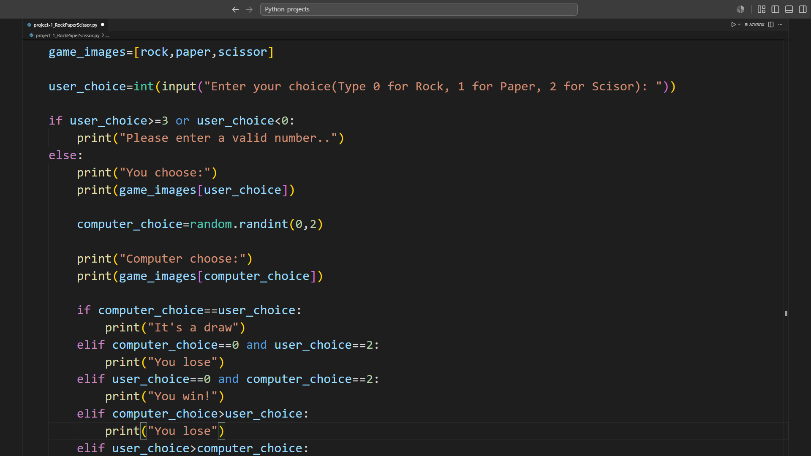
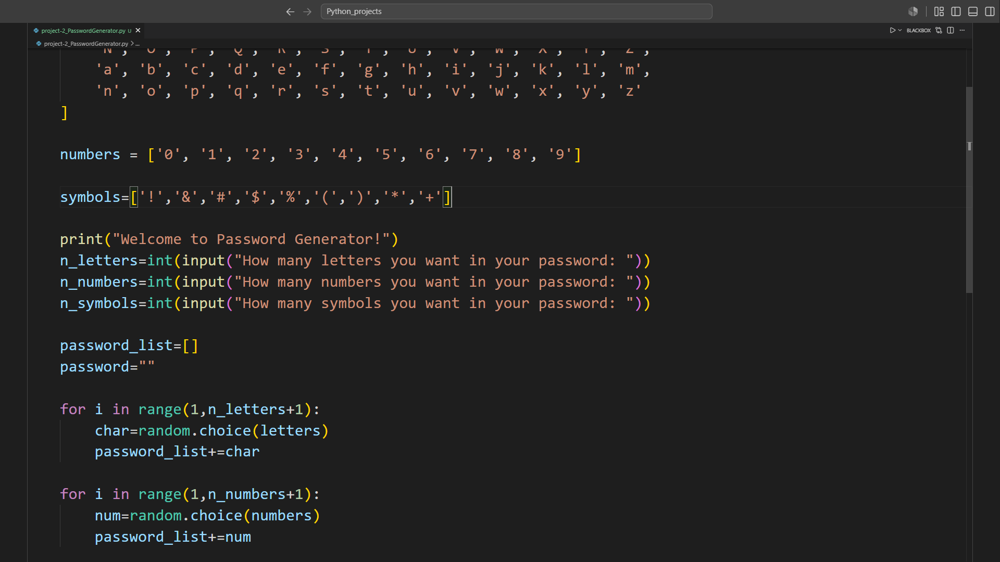

# Python-Projects

## Project-1 : Rock Paper Scissors Game

A simple command-line Rock Paper Scissors game built using Python. The player competes against the computer, which randomly chooses Rock, Paper, or Scissors.

### Features

- Interactive gameplay through the terminal
- Random computer choices using Python's `random` module
- ASCII art representation of Rock, Paper, and Scissors
- Win, lose, and draw detection
- Input validation for invalid choices

### Example Output 

Enter your choice(Type 0 for Rock, 1 for Paper, 2 for Scisor):0

You chose: Rock
Computer chose: Scissors

You win!

### Preview




## Project-2 : Password Generator

A simple Python program that generates a random password based on the number of letters, numbers, and symbols specified by the user.

### Features

- Generates random passwords
- Includes uppercase and lowercase letters
- Includes digits (0-9)
- Includes special symbols
- User can customize the number of:
  - Letters
  - Numbers
  - Symbols

### Example Output
```text
Welcome to Password Generator!
How many letters you want in your password: 5
How many numbers you want in your password: 3
How many symbols you want in your password: 2
```

Password: AbXde731!$

### Preview




